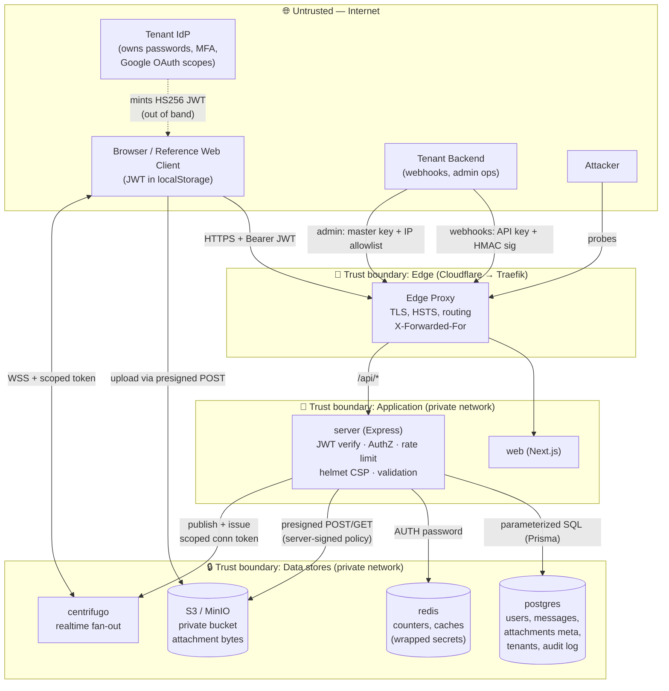

# Threat Model — chat-app

**Owner:** Engineering
**Last reviewed:** 2026-07-26
**Review cadence:** every release with an auth/data-flow change, at minimum annually (CASA re-cert).
**Method:** STRIDE over the data-flow diagram below.

This document supports CASA Tier 2 / OWASP ASVS V1 (Architecture, Design & Threat Modeling). Companion: [../CASA_ASVS_GAP_CHECKLIST.md](../CASA_ASVS_GAP_CHECKLIST.md).

---

## 1. System overview

chat-app is a multi-tenant chat backend (`apps/server`, Node/Express) with a reference web client (`apps/web`, Next.js). It is a **stateless, federated bearer-JWT resource server**: it does **not** authenticate end users itself. Each tenant runs its own identity provider (IdP) — including any Google OAuth flow — and mints short-lived HS256 JWTs that this server only *verifies*.

**Key consequence for CASA scope:** end-user password auth, MFA, account lockout, and password reset live in the tenant IdP, not here. Any Google restricted/sensitive OAuth scope handling that triggers CASA is a property of the **tenant IdP**, which is a separate trust domain from this server.

### Components
| Component | Role | Exposure |
|---|---|---|
| `server` | REST API + auth verification + business logic | Public via edge proxy (`/api/*`) |
| `web` | Reference Next.js client | Public via edge proxy (`/`) |
| `postgres` | System of record (users, messages, attachments meta, tenants, audit log) | Private network only |
| `redis` | Rate-limit counters, caches (wrapped secrets), pub/sub | Private network only, password-protected |
| `minio`/S3 | Attachment object storage (private bucket) | Private; browser access only via short-lived signed URLs |
| `centrifugo` | Realtime message/event fan-out | Private; browser connects with a scoped, short-TTL token |
| `migrate` | One-shot Prisma migration runner | Ephemeral, private |
| Edge proxy | Traefik (Dokploy host) behind Cloudflare CDN | TLS termination, HSTS, routing |

---

## 2. Data-flow diagram

### Trust boundaries
1. **Internet → Edge** — TLS, HSTS (2y + preload), CDN. Everything beyond is authenticated.
2. **Edge → Application** — the server re-derives client IP only from `TRUST_PROXY_CIDRS`; admin IP allowlisting uses the raw TCP peer (`req.socket.remoteAddress`), never the spoofable `X-Forwarded-For`.
3. **Application → Data stores** — private network; no data store is internet-reachable. Redis is password-gated; S3 bucket is private; Centrifugo admin/API is locked down.
4. **Tenant IdP** — a *separate* trust domain that mints JWTs; the server trusts a JWT only if it verifies against the tenant's stored `jwtSecret` with matching `iss`/`aud` and an unexpired, non-revoked `iat`.

---

## 3. Assets & sensitivity

| Asset | Sensitivity | Where |
|---|---|---|
| `Tenant.jwtSecret` (HMAC key for ALL a tenant's user tokens) | **Critical** — leak enables token forgery for every user | postgres (AES-256-GCM wrapped at rest when `JWT_SECRET_ENCRYPTION_KEY` set; **required in prod**), plaintext only in memory |
| `Tenant.apiKeyHash` | High | postgres (Argon2id hash only) |
| `MASTER_API_KEY` | Critical (operator) | env only; never stored; SHA-256 + constant-time compare |
| Message content (`content`, `plainContent`) | High (user data) | postgres |
| Attachment bytes | High (user data) | private S3 bucket, signed-URL access only |
| User PII (`name`, `email`, `image`, `externalId`, `lastActiveAt`) | Moderate | postgres; minimized in tokens/responses |
| Push subscription keys (`p256dh`, `auth`) | Moderate | postgres; redacted in logs |
| Admin audit log | Moderate (integrity-sensitive) | postgres, append-only |

---

## 4. STRIDE analysis → controls

### Spoofing (identity)
- **JWT forgery / algorithm confusion** → HS256 pinned (`algorithms:["HS256"]`); `aud=chat-app` + `iss` verified *and* re-asserted; per-tenant secret selection. *Residual:* leaked `jwtSecret` → forgery; mitigated by at-rest encryption + rotation endpoint.
- **Webhook forgery** → tenant API key (Argon2) **plus** mandatory `X-Chat-Signature` HMAC (`WEBHOOK_SIGNATURE_REQUIRED=true`), constant-time compared.
- **Admin impersonation** → master key (SHA-256 + `timingSafeEqual`) **and** IP allowlist on raw TCP peer.
- **Client IP spoofing (XFF)** → only `TRUST_PROXY_CIDRS` proxies are trusted; admin/audit uses socket peer.

### Tampering
- **SQL injection** → Prisma parameterized queries; `escapeLike()` on ILIKE search. *(DAST: all SQLi rules PASS.)*
- **Stored-secret tampering** → AES-256-GCM auth tag on wrapped secrets.
- **Cursor/param tampering** → HMAC-signed list cursors (constant-time verify); `idParam()` charset validation.
- **Rich-text/HTML injection** → Tiptap AST canonicalized server-side; never trust client HTML; depth/node caps before render.

### Repudiation
- **Admin actions** → append-only `admin_audit_log` (action, tenantId, actor socket IP, requestId) with no FK so rows survive tenant deletion; secrets never written.
- **Auth denials** → structured `security.auth_denied` events (actor IP, path, code) for SIEM correlation.
- Request-id propagation ties access logs to audit rows.

### Information disclosure
- **Header/error leakage** → helmet CSP `default-src 'none'`; no `X-Powered-By`/server banner; generic 500s (stack logged only); 404 (not 403) for cross-tenant rows to avoid enumeration; `/metrics` 404 on bad token. *(DAST: info-disclosure rules PASS.)*
- **PII in logs** → pino redaction (authorization, cookie, password, token, secret, push keys, content); query strings stripped; email no longer logged on GDPR delete.
- **Attachment exposure** → private bucket; short-lived signed URLs (view 300s / download 120s); SVG/XML never served inline.
- **PII minimization** → JWTs omit internal ids; `publicUserSchema` drops email; email in directory search is an access-controlled, in-tenant feature (documented).

### Denial of service
- **Request floods** → Redis-backed per-user + per-IP rate limits (send/search/upload/reactions/etc.); `preAuthIpLimiter` in front of expensive crypto-verify routers.
- **Body/parse DoS** → 512KB body cap + Tiptap structural depth/node caps; billion-laughs / entity-expansion covered. *(DAST: entity-expansion PASS.)*
- **Push/mention abuse** → per-recipient mention throttle; `MAX_MENTIONS_PER_MESSAGE=50`.
- **Storage exhaustion** → per-user + per-tenant attachment quotas (atomic at presign); orphan-attachment GC (6h).

### Elevation of privilege
- **IDOR / cross-tenant access** → every query filtered by `tenantId` + membership; attachment `/view`/`/download` membership-checked before signing; scope partitioning (`scope` claim) for intra-tenant isolation.
- **Container escape / blast radius** → non-root `node` user; `cap_drop:[ALL]` + `no-new-privileges` on all services; pinned image digests; data stores off the public network.
- **Token replay after logout/delete** → `tokensValidAfter` horizon + `/me/revoke`; GDPR tombstone → 410 for 30 days.

---

## 5. Key residual risks & assumptions

| Risk | Status / mitigation |
|---|---|
| Web client stores JWT in `localStorage` (XSS-exposed, no HttpOnly) | Accepted; mitigated by strict CSP `default-src 'none'`. Bearer-only design (no cookies) is a deliberate cross-origin trade-off. |
| `jwtSecret` plaintext at rest if `JWT_SECRET_ENCRYPTION_KEY` unset | **Closed for prod** — boot now fails without the key. |
| Tenant IdP compromise | Out of scope for this server; tenant owns its IdP + OAuth scopes. Documented trust boundary. |
| Optional AV scanning (ClamAV) not always enabled | Compensating controls: magic-byte sniffing (polyglot deletion), private bucket, signed URLs. Prod boot warns when off. |
| Upstream dependency CVE | `pnpm audit` (moderate) + SBOM + gitleaks/semgrep in CI. |

---

## 6. Verification

Controls above are exercised by: 63 server unit tests; `security.yml` CI (gitleaks, semgrep OWASP-Top-Ten, `pnpm audit`, SBOM); and an authenticated OWASP ZAP active DAST across all 31 endpoints — **0 High/Medium/failures** (see `security-reports/`).
